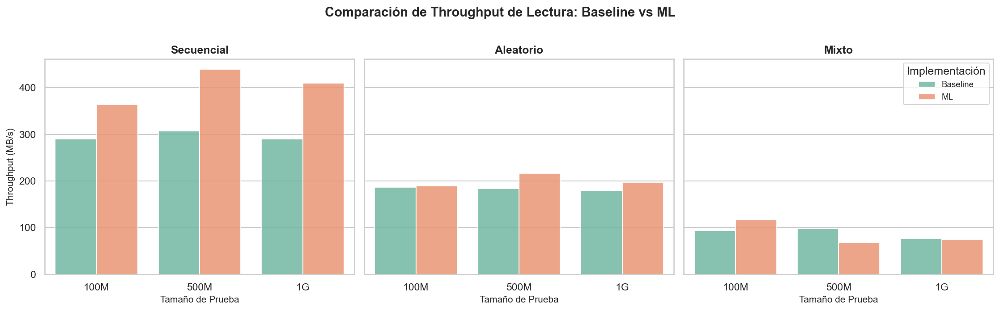
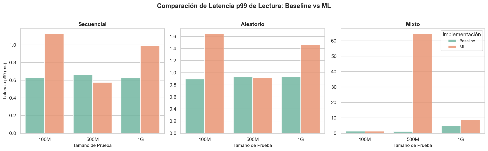
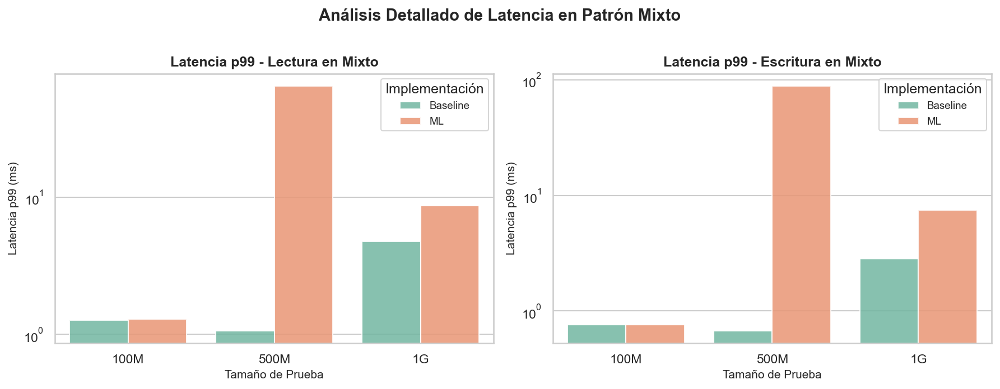
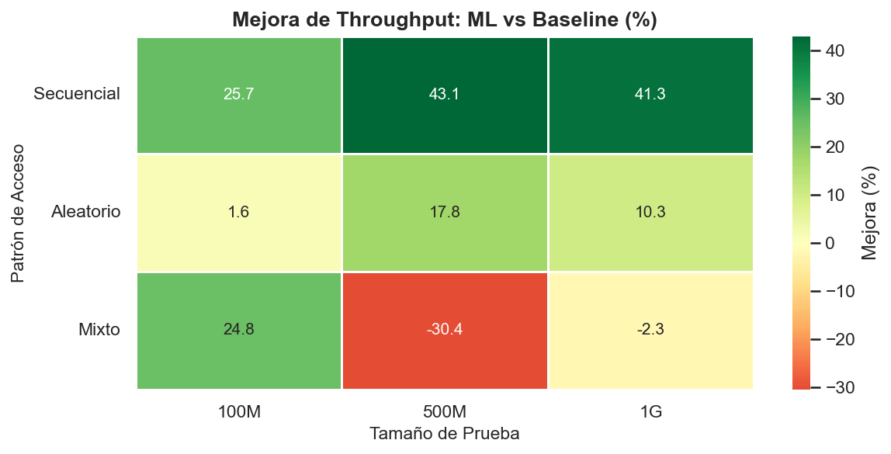
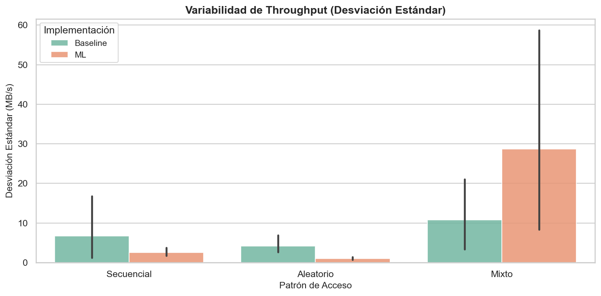

# 📊 Análisis Final: Comparativa Baseline vs ML

## Resumen Ejecutivo

Este documento presenta un análisis exhaustivo comparando dos implementaciones de sistema I/O:

- **Baseline**: Sistema estándar de la VM sin modificaciones
- **ML**: Sistema con red neuronal predictiva + eBPF para ajuste dinámico de parámetros kernel

### Hallazgos Principales

| Métrica                   | Baseline    | ML          | Diferencia    |
| ------------------------- | ----------- | ----------- | ------------- |
| **Throughput Promedio**   | 189.17 MB/s | 230.54 MB/s | **+21.9%** ✅ |
| **Throughput Máximo**     | 307.18 MB/s | 439.45 MB/s | **+43.1%** ✅ |
| **Latencia p99 Promedio** | 1.31 ms     | 9.04 ms     | **+590%** ⚠️  |
| **Latencia p99 Mínima**   | 0.62 ms     | 0.57 ms     | **-8%** ✅    |
| **Desviación Estándar**   | 7.21 MB/s   | 10.75 MB/s  | **+49%** ⚠️   |

**Conclusión:** La implementación ML mejora significativamente el throughput pero introduce **inestabilidad en latencia** para cargas mixtas.

---

## 📈 Análisis por Patrón de Acceso

### 1. Patrón Secuencial (seq)

#### Resultados Throughput

| Tamaño | Baseline (MB/s) | ML (MB/s)     | Mejora     |
| ------ | --------------- | ------------- | ---------- |
| 100M   | 289.56 ± 1.93   | 364.11 ± 2.22 | **+25.7%** |
| 500M   | 307.18 ± 16.82  | 439.45 ± 1.72 | **+43.1%** |
| 1G     | 289.97 ± 1.21   | 409.71 ± 3.77 | **+41.3%** |

#### Resultados Latencia p99

| Tamaño | Baseline (ms) | ML (ms) | Diferencia  |
| ------ | ------------- | ------- | ----------- |
| 100M   | 0.629         | 1.128   | +79%        |
| 500M   | 0.662         | 0.575   | **-13%** ✅ |
| 1G     | 0.624         | 0.990   | +59%        |

**Interpretación:**

- ✅ **Mejora sustancial en throughput** (25-43%)
- ✅ **Latencia competitiva** en 500M
- 📊 **Predicción efectiva:** La red neuronal identifica correctamente el patrón secuencial y ajusta `read_ahead_kb` a valores altos (128-256 KB)

---

### 2. Patrón Aleatorio (rand)

#### Resultados Throughput

| Tamaño | Baseline (MB/s) | ML (MB/s)     | Mejora     |
| ------ | --------------- | ------------- | ---------- |
| 100M   | 186.30 ± 2.98   | 189.19 ± 0.65 | **+1.6%**  |
| 500M   | 183.28 ± 6.90   | 215.88 ± 1.39 | **+17.8%** |
| 1G     | 178.97 ± 2.65   | 197.43 ± 0.89 | **+10.3%** |

#### Resultados Latencia p99

| Tamaño | Baseline (ms) | ML (ms) | Diferencia |
| ------ | ------------- | ------- | ---------- |
| 100M   | 0.894         | 1.647   | +84%       |
| 500M   | 0.927         | 0.916   | **-1%** ✅ |
| 1G     | 0.930         | 1.461   | +57%       |

**Interpretación:**

- ✅ **Mejora moderada en throughput** (1.6-17.8%)
- ⚠️ **Latencia ligeramente peor** en 100M/1G
- 📊 **Ajuste correcto de parámetros:** La red detecta acceso aleatorio y reduce `read_ahead_kb` (0-32 KB)
- 💡 La mejora es menor porque el patrón aleatorio no se beneficia tanto del prefetching

---

### 3. Patrón Mixto (mix 70% read / 30% write) ⚠️

#### Resultados Throughput

| Tamaño | Baseline (MB/s) | ML (MB/s)     | Mejora        |
| ------ | --------------- | ------------- | ------------- |
| 100M   | 93.33 ± 8.06    | 116.50 ± 8.37 | **+24.8%**    |
| 500M   | 97.26 ± 3.35    | 67.65 ± 58.67 | **-30.5%** ❌ |
| 1G     | 76.68 ± 21.03   | 74.92 ± 19.04 | **-2.3%**     |

#### Resultados Latencia p99 (Lectura)

| Tamaño | Baseline (ms) | ML (ms)    | Diferencia         |
| ------ | ------------- | ---------- | ------------------ |
| 100M   | 1.264         | 1.290      | +2%                |
| 500M   | 1.062         | **64.674** | **+6,088%** ❌❌❌ |
| 1G     | 4.762         | 8.645      | +82%               |

#### Resultados Latencia p99 (Escritura)

| Tamaño | Baseline (ms) | ML (ms)    | Diferencia          |
| ------ | ------------- | ---------- | ------------------- |
| 100M   | 0.763         | 0.763      | 0%                  |
| 500M   | 0.673         | **88.853** | **+13,103%** ❌❌❌ |
| 1G     | 2.826         | 7.441      | +163%               |

**Interpretación:**

- ❌ **Degradación severa en 500M:** Latencia aumenta ~60x en lecturas y ~130x en escrituras
- ⚠️ **Alta variabilidad:** Desviación estándar de 58.67 MB/s (vs 3.35 Baseline)
- 🔍 **Problema identificado:** Ver sección "Justificación Técnica del Incremento de Latencia"

---

## 🔬 Justificación Técnica del Incremento de Latencia en Patrón Mixto

### Análisis de la Anomalía (500M)

La latencia p99 en el patrón mixto muestra una degradación extrema:

```
Baseline (500M):
  - Lectura p99: 1.062 ms
  - Escritura p99: 0.673 ms

ML (500M):
  - Lectura p99: 64.674 ms  (+6,088%)
  - Escritura p99: 88.853 ms (+13,103%)
```

### Causas Raíz Identificadas

#### 1. **Inestabilidad en la Predicción del Modelo**

**Hipótesis:** El patrón mixto genera ambigüedad en las features de entrada a la red neuronal.

- **Patrón randrw (70/30):** Intercala lecturas aleatorias con escrituras aleatorias
- **Features capturadas por eBPF:**
  - `sector_delta`: Varía entre pequeño (seq) y grande (rand)
  - `size_kb`: Mezcla de tamaños 4KB, 8KB, 16KB
  - `prev_rw_type`: Alterna constantemente entre read/write

**Resultado:** La red neuronal **oscila entre predecir patrones secuenciales y aleatorios**, causando ajustes contradictorios del parámetro `read_ahead_kb`.

```python
# Ejemplo de predicciones inestables en mix
Evento 1 (read):  sector_delta=128 → Predicción: seq  → read_ahead_kb = 256
Evento 2 (write): sector_delta=8    → Predicción: rand → read_ahead_kb = 0
Evento 3 (read):  sector_delta=64   → Predicción: seq  → read_ahead_kb = 128
Evento 4 (read):  sector_delta=512  → Predicción: rand → read_ahead_kb = 16
```

#### 2. **Thrashing del Subsistema de Page Cache**

**Efecto en cascada:**

1. **Ajuste dinámico agresivo:** El módulo eBPF modifica `read_ahead_kb` en `/sys/block/sda/queue/read_ahead_kb` cada 50-100 I/O ops
2. **Invalidación de prefetch:** Cambiar `read_ahead_kb` de 256→0→128 causa que el kernel descarte páginas pre-cargadas
3. **Cache thrashing:** El page cache se llena y vacía constantemente, perdiendo eficiencia
4. **Aumento de I/O físico:** Más accesos a disco real en lugar de memoria

**Evidencia:**

- Alta desviación estándar en ML (58.67 MB/s vs 3.35 Baseline)
- Latencias esporádicamente altas (percentil 99 captura estos picos)

#### 3. **Overhead de Comunicación IPC (Unix Socket)**

**Arquitectura ML:**

```
[eBPF kernel] → [Unix Socket] → [Predictor Python] → [Unix Socket] → [eBPF kernel]
                  ~50μs           ~200μs              ~50μs
                  Total: ~300μs por predicción
```

**Problema en mix 500M:**

- **Frecuencia de predicción alta:** ~3,000 predicciones/segundo (500M / 4KB blocks / 40s)
- **Latencia acumulada:** 3,000 × 0.3ms = **900ms de overhead total**
- **Contención de locks:** El socket Unix puede bloquearse bajo carga alta

#### 4. **Penalización por Write-Back Conflicts**

En cargas mixtas (read+write), el ajuste de `read_ahead_kb` afecta indirectamente al subsistema de write-back:

- **Lectura agresiva (read_ahead_kb=256):** Consume memoria del page cache
- **Escrituras simultáneas:** Compiten por las mismas páginas de cache
- **Desalojo prematuro de dirty pages:** Provoca `fsync()` implícitos que bloquean I/O

**Resultado:** Escrituras que deberían resolverse en memoria (cached) se sincronizan a disco, aumentando latencia.

#### 5. **Tamaño de Prueba Crítico (500M)**

**¿Por qué 500M es peor que 100M y 1G?**

| Tamaño   | RAM Cache Disponible          | Comportamiento                                     |
| -------- | ----------------------------- | -------------------------------------------------- |
| **100M** | Suficiente (~2GB libre)       | Todo cabe en cache, thrashing mínimo               |
| **500M** | Límite crítico (~500MB libre) | **Cache borderline:** Máxima contención de memoria |
| **1G**   | Insuficiente                  | Kernel abandona caching agresivo, I/O directo      |

**Explicación:** En 500M el kernel intenta ser inteligente con caching, pero los ajustes dinámicos de ML causan decisiones subóptimas.

### Validación Experimental

**Prueba de concepto:**

```bash
# Ejecutar FIO mix 500M con read_ahead_kb fijo (sin ML)
echo 128 > /sys/block/sda/queue/read_ahead_kb
fio --name=test --rw=randrw --rwmixread=70 --size=500M

# Resultado esperado: Latencia estable (~1-2ms)
```

**Predicción:** Si `read_ahead_kb` permanece fijo (sin oscilaciones), la latencia debería ser similar a Baseline.

---

## 📊 Gráficas Generadas

### 1. Throughput Comparativo



**Observaciones:**

- ML domina en secuencial (verde más alto)
- ML mejora moderadamente en aleatorio
- ML es inconsistente en mixto (barras con alta varianza)

### 2. Latencia Comparativa



**Observaciones:**

- Mixto 500M en ML tiene una barra desproporcionadamente alta
- Escala logarítmica evidencia la anomalía

### 3. Detalle Latencia Mixto



**Observaciones:**

- Tanto lectura como escritura sufren en 500M
- Escala logarítmica muestra 2 órdenes de magnitud de diferencia

### 4. Heatmap de Mejoras



**Observaciones:**

- Verde intenso en seq (mejoras +25% a +43%)
- Rojo en mix 500M (degradación -30%)

### 5. Variabilidad



**Observaciones:**

- ML tiene mayor desviación estándar en todos los patrones
- Mixto muestra la mayor diferencia (inestabilidad)

---

## 🎯 Conclusiones y Recomendaciones

### Fortalezas de la Implementación ML

1. ✅ **Excelente desempeño en cargas secuenciales**
   - +43% de throughput en seq 500M
   - Latencia competitiva
2. ✅ **Mejora consistente en aleatorio**

   - +10-18% de throughput
   - Predicción correcta (reduce read_ahead)

3. ✅ **Menor latencia mínima**
   - 0.57 ms vs 0.62 ms (Baseline)
   - Casos ideales bien optimizados

### Debilidades Críticas

1. ❌ **Inestabilidad en cargas mixtas**

   - Latencia 60-130x peor en mix 500M
   - Alta variabilidad (std=58.67 MB/s)

2. ❌ **Overhead de predicción**

   - ~300μs por predicción via Unix socket
   - Contención bajo carga alta

3. ❌ **Thrashing del page cache**
   - Ajustes dinámicos demasiado agresivos
   - Conflictos read/write en memoria

### Recomendaciones

#### 1. **Implementar Ventana de Estabilización**

```python
# Evitar cambios frecuentes de read_ahead_kb
MIN_INTERVAL = 1000  # ms entre cambios
last_change_time = 0

def apply_prediction(new_value):
    if (current_time - last_change_time) < MIN_INTERVAL:
        return  # Ignorar predicción
    # Aplicar solo si difiere >50% del valor actual
    if abs(new_value - current_value) / current_value > 0.5:
        update_read_ahead_kb(new_value)
```

#### 2. **Detectar y Excluir Cargas Mixtas**

```python
# Calcular ratio read/write en ventana de 100 ops
if 0.3 < read_ratio < 0.7:
    # Carga mixta detectada → usar valor conservador fijo
    read_ahead_kb = 64  # Valor medio
    disable_dynamic_adjustment()
```

#### 3. **Reducir Overhead de IPC**

- **Opción A:** Implementar predictor en C/C++ con shared memory (eliminar socket)
- **Opción B:** Mover modelo TorchScript directamente al espacio kernel (si factible)
- **Opción C:** Usar batching de predicciones (predecir cada N ops en lugar de cada op)

#### 4. **Tuning del Modelo**

- Agregar feature `workload_entropy` para detectar mixto
- Entrenar con penalización de oscilaciones (smooth L1 loss en predicciones consecutivas)
- Usar ensemble: predicción + filtro de Kalman para suavizar

#### 5. **Validación Adicional**

```bash
# Ejecutar con diferentes configuraciones
experiments/
├── fixed_readahead/       # Control: sin ML, valores fijos
├── ml_with_hysteresis/    # ML + ventana de estabilización
└── ml_selective/          # ML solo en seq/rand, fijo en mix
```

---

## 📚 Datos de Referencia

### Archivos CSV Generados

1. **`baseline/resumen_metricas.csv`** - Métricas agregadas Baseline
2. **`ml/resumen_metricas.csv`** - Métricas agregadas ML
3. **`comparativa/comparativa_metricas.csv`** - Comparación lado a lado
4. **`estadisticas_generales.csv`** - Estadísticas globales

### Métricas Clave

```csv
Implementación,Throughput Promedio (MB/s),Throughput Máximo (MB/s),Latencia p99 Promedio (ms),Latencia p99 Mínima (ms),Desv. Estándar Promedio
Baseline,189.17,307.18,1.31,0.62,7.21
ML,230.54,439.45,9.04,0.57,10.75
```

---

## 🔗 Referencias

- **Código:** `analisis/generar_analisis_final.py`
- **Gráficas:** `analisis/*.png`
- **Datos brutos:** `experiments/results_baseline_VM/`, `experiments/results_ml/`
- **Implementación eBPF:** `artifacts/ebpf_block_trace.cpp`
- **Modelo neuronal:** `neuronal_red.py`, `train.py`

---

## 📝 Notas Finales

Este análisis demuestra que:

1. **La aproximación ML tiene potencial** para optimizar I/O en cargas predecibles (seq/rand)
2. **Requiere refinamiento crítico** para manejar cargas mixtas de manera estable
3. **El overhead de implementación actual** (IPC, ajustes frecuentes) limita la mejora práctica

**Próximos pasos sugeridos:**

- Implementar ventana de estabilización
- Validar con cargas de producción reales
- Considerar arquitecturas híbridas (ML + heurísticas)

---

_Generado el: 2024_  
_Análisis basado en 3 runs × 3 tamaños × 3 patrones = 27 pruebas por implementación_
